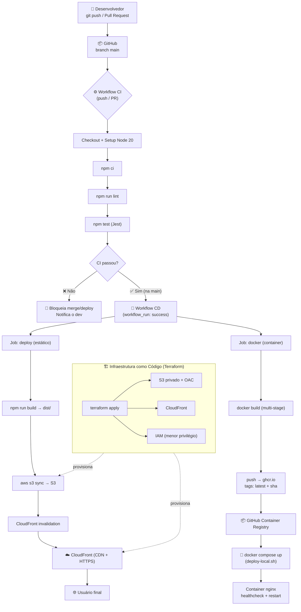

# Relatório Final — Projeto DevOps: Capacitações CRUD

> **Disciplina:** DevOps
> **Aplicação:** Capacitações CRUD (React + TypeScript + Vite)
> **Repositório:** `github.com/bdoprado/projeto-devops`
> **Data:** Junho de 2026

---

## Sumário

1. [Visão geral do projeto](#1-visão-geral-do-projeto)
2. [Fase 1 — Integração Contínua e Infraestrutura como Código](#2-fase-1--integração-contínua-e-infraestrutura-como-código)
3. [Fase 2 — Entrega Contínua, Containers, Monitoramento e Segurança](#3-fase-2--entrega-contínua-containers-monitoramento-e-segurança)
   - [3.1 Entrega Contínua (CD)](#31-entrega-contínua-cd)
   - [3.2 Containers e Orquestração](#32-containers-e-orquestração)
   - [3.3 Scripts de Deploy](#33-scripts-de-deploy)
   - [3.4 Monitoramento e Logging](#34-monitoramento-e-logging)
   - [3.5 Segurança em DevOps](#35-segurança-em-devops)
   - [3.6 Testes](#36-testes)
   - [3.7 Gerenciamento de Configurações](#37-gerenciamento-de-configurações)
4. [Fluxograma do fluxo DevOps completo](#4-fluxograma-do-fluxo-devops-completo)
5. [Demonstração prática](#5-demonstração-prática)
6. [Análise crítica](#6-análise-crítica)
7. [Melhorias futuras](#7-melhorias-futuras)

---

## 1. Visão geral do projeto

O **Capacitações CRUD** é uma aplicação web *frontend* (SPA — *Single Page Application*) desenvolvida em **React + TypeScript** e empacotada com **Vite**. Permite registrar, visualizar, editar e excluir capacitações (treinamentos internos), com persistência local via `localStorage`. Por ser puramente estática, não requer servidor de aplicação — todo o runtime executa no navegador.

O objetivo do projeto, do ponto de vista de DevOps, é exercitar o ciclo completo: **integração contínua → infraestrutura como código → entrega contínua → containerização → orquestração → monitoramento → segurança**, com automação de ponta a ponta a partir de um `git push`.

### Estrutura do repositório

```
projeto-devops/
├── .github/workflows/
│   ├── ci.yml                  # Integração Contínua (lint + testes)
│   └── cd.yml                  # Entrega Contínua (deploy S3/CloudFront + push GHCR)
├── capacitacoes-crud/          # Aplicação React + TypeScript + Vite
│   ├── src/                    # Código-fonte e testes (Jest + Testing Library)
│   ├── Dockerfile              # Build multi-stage (Vite → nginx)
│   ├── nginx.conf              # Roteamento SPA, gzip, cache
│   ├── security-headers.conf   # Headers de segurança HTTP
│   └── .dockerignore
├── terraform/                  # Infraestrutura como Código (S3 + CloudFront + IAM)
│   ├── main.tf
│   ├── variables.tf
│   └── outputs.tf
├── scripts/
│   ├── deploy-local.sh         # Build + run do container via Docker Compose
│   └── build-push.sh           # Build + push da imagem para o GHCR
├── docker-compose.yml          # Orquestração local
└── docs/
    ├── planejamento-infraestrutura.md   # Documentação da Fase 1
    └── relatorio-final.md               # Este documento
```

### Stack de ferramentas

| Categoria | Ferramenta |
|---|---|
| Linguagem / framework | TypeScript, React 19, Vite |
| Testes | Jest + Testing Library |
| Lint | ESLint |
| CI/CD | GitHub Actions |
| Containerização | Docker (multi-stage), nginx |
| Orquestração | Docker Compose |
| Registry de imagens | GitHub Container Registry (ghcr.io) |
| IaC | Terraform |
| Hospedagem | AWS S3 + CloudFront (CDN/HTTPS) |

---

## 2. Fase 1 — Integração Contínua e Infraestrutura como Código

> Documentação completa em [`planejamento-infraestrutura.md`](planejamento-infraestrutura.md).

### 2.1 Integração Contínua (CI)

O workflow **CI** (`.github/workflows/ci.yml`) é executado em todo `push` e `pull_request` para a branch `main`. Etapas:

1. Checkout do repositório
2. Setup do Node.js 20 (com cache de `npm`)
3. `npm ci` — instalação determinística a partir do lockfile
4. `npm run lint` — análise estática com ESLint
5. `npm test` — testes unitários e de componente com Jest

O objetivo é **garantir que nenhum código quebrado entre na `main`**: a esteira valida estilo e comportamento antes de qualquer deploy.

### 2.2 Infraestrutura como Código (Terraform)

Toda a infraestrutura AWS é descrita declarativamente em `terraform/`, sendo reproduzível com `terraform apply`:

- **S3** — bucket privado (Block Public Access habilitado) que armazena os artefatos estáticos.
- **CloudFront** — CDN que serve o conteúdo via **HTTPS**, com acesso ao bucket restrito por **OAC** (Origin Access Control). Inclui *custom error responses* (403/404 → `/index.html`) para suportar o roteamento client-side da SPA.
- **IAM** — usuário dedicado de deploy com política de **menor privilégio** (apenas `s3:PutObject/GetObject/DeleteObject/ListBucket` no bucket e `cloudfront:CreateInvalidation` na distribuição).

---

## 3. Fase 2 — Entrega Contínua, Containers, Monitoramento e Segurança

### 3.1 Entrega Contínua (CD)

O workflow **CD** (`.github/workflows/cd.yml`) é disparado automaticamente via `workflow_run` quando o **CI conclui com sucesso na `main`**. Isso garante a regra de ouro da entrega contínua: **só se entrega o que passou na integração**.

O CD possui **dois jobs independentes e paralelos**:

#### Job `deploy` — publicação estática (S3 + CloudFront)
1. Checkout + Setup Node 20
2. `npm ci` e `npm run build` (gera `dist/`)
3. Configura credenciais AWS (via *secrets*)
4. `aws s3 sync` dos artefatos para o bucket (com `--delete`, exceto `index.html`)
5. `index.html` é enviado com `Cache-Control: no-cache` (deploy imediato)
6. **Invalidação do cache do CloudFront** (`/*`) para propagar a nova versão

#### Job `docker` — empacotamento containerizado (GHCR)
1. Checkout
2. Login no **GitHub Container Registry** (`ghcr.io`) usando o `GITHUB_TOKEN`
3. `docker/metadata-action` gera tags (`latest` + `sha-<commit>`)
4. `docker/build-push-action` builda a imagem multi-stage e publica no GHCR, com **cache de camadas via GitHub Actions** (`type=gha`)

Assim, **todo commit aprovado na `main` gera simultaneamente**: (a) o deploy estático em produção e (b) uma imagem de container versionada e rastreável (tag = hash do commit), pronta para ser executada em qualquer ambiente compatível com Docker.

> **Custo:** o GHCR é **gratuito** para pacotes públicos e o GitHub Actions é ilimitado em repositórios públicos — não há custo adicional para o pipeline de container.

### 3.2 Containers e Orquestração

#### Containerização (Docker)

A aplicação é containerizada com um **Dockerfile multi-stage** (`capacitacoes-crud/Dockerfile`):

- **Estágio 1 (`build`)** — `node:20-alpine`: instala dependências (`npm ci`) e gera o build de produção (`npm run build`).
- **Estágio 2 (`runtime`)** — `nginx:1.27-alpine`: copia **apenas** os artefatos estáticos de `dist/` e a configuração do nginx.

Benefícios do multi-stage:
- A imagem final **não contém Node.js, código-fonte nem `node_modules`** — somente o nginx e os arquivos estáticos.
- Imagem final enxuta: **~74 MB** (medido localmente).
- `.dockerignore` evita enviar `node_modules`, `.git` etc. para o contexto de build.

O `nginx.conf` configura:
- **Roteamento SPA** — `try_files $uri $uri/ /index.html` (qualquer rota cai no `index.html`).
- **Compressão gzip** dos assets de texto.
- **Estratégia de cache** — assets com hash (`/assets/`) são imutáveis (`Cache-Control: public, immutable, 1y`); o `index.html` nunca é cacheado.
- **Healthcheck** — `wget --spider http://127.0.0.1/`; usar `127.0.0.1` (e não `localhost`) é necessário porque o nginx escuta em IPv4 e `localhost` resolve para IPv6 dentro do container.

#### Orquestração (Docker Compose)

O `docker-compose.yml` orquestra o container com práticas de produção:
- **Mapeamento de porta** `8080:80`
- **`restart: unless-stopped`** — reinício automático em caso de falha
- **`healthcheck`** integrado (intervalo de 30s)
- **Limites de recursos** — `cpus: 0.50`, `memory: 128M`, evitando que o container consuma o host
- Suporte a usar a **imagem publicada no GHCR** (variável `IMAGE`) ou buildar localmente

### 3.3 Scripts de Deploy

Em `scripts/`, dois scripts encapsulam o deploy baseado em containers:

| Script | Função |
|---|---|
| `deploy-local.sh` | Encerra a instância anterior, builda e sobe o container via Compose, aguarda o `healthcheck` ficar `healthy` e expõe a aplicação em `http://localhost:8080`. |
| `build-push.sh` | Builda a imagem de produção e publica no GHCR (mesmo artefato do CD), permitindo reprodução/publicação manual. |

### 3.4 Monitoramento e Logging

- **Logging** — o nginx grava logs de acesso e erro em `stdout`/`stderr`, capturados pelo Docker (`docker compose logs -f web`). Em uma orquestração maior, esses logs seriam coletados por um agregador (ex.: Loki, ELK, CloudWatch Logs).
- **Monitoramento de saúde** — o `healthcheck` do container expõe o estado (`healthy`/`unhealthy`), permitindo que o orquestrador reinicie ou substitua instâncias com falha. Em produção AWS, o **CloudFront/S3** já oferece métricas de requisições, taxa de erro (4xx/5xx) e latência via **CloudWatch**.

### 3.5 Segurança em DevOps

Práticas de segurança aplicadas em cada camada:

| Camada | Prática |
|---|---|
| **Infraestrutura** | Bucket S3 privado (sem acesso público); acesso somente via CloudFront/OAC; HTTPS obrigatório (`redirect-to-https`). |
| **IAM** | Usuário de deploy com política de **menor privilégio**. |
| **Pipeline** | Credenciais via **GitHub Secrets** (nunca no código); `GITHUB_TOKEN` efêmero com escopo `packages: write` apenas no job que precisa. |
| **Container** | Imagem base Alpine (superfície de ataque reduzida); imagem sem código-fonte nem toolchain de build; `server_tokens off` (não expõe a versão do nginx). |
| **Aplicação (HTTP)** | Headers de segurança: `Content-Security-Policy`, `X-Frame-Options`, `X-Content-Type-Options`, `Referrer-Policy`, `Permissions-Policy` — aplicados em **todas** as rotas via `include` do `security-headers.conf`. |
| **Dependências** | `npm ci` a partir do lockfile (builds determinísticos e auditáveis). |

### 3.6 Testes

- **Testes unitários e de componente** com **Jest + Testing Library**, cobrindo os componentes (`CapacitacaoForm`, `CapacitacaoTable`) e o serviço de persistência (`capacitacaoStorage`).
- Executados automaticamente no **CI** — são um **gate**: se falharem, o CD não roda e nada é entregue.
- Validação do **artefato de deploy**: o container foi buildado e executado localmente, confirmando HTTP 200, fallback de SPA, presença dos headers de segurança e `healthcheck` `healthy`.

### 3.7 Gerenciamento de Configurações

- **Infraestrutura** versionada como código (Terraform) — toda mudança passa pelo Git.
- **Configuração da aplicação** (nginx, headers, cache) versionada junto ao código.
- **Configuração do pipeline** (workflows) versionada em `.github/workflows/`.
- **Segredos** geridos fora do versionamento, via GitHub Secrets.
- **Imagens** versionadas por tag = hash do commit no GHCR, garantindo rastreabilidade entre código e artefato executável.

---

## 4. Fluxograma do fluxo DevOps completo



### Legenda do fluxo

1. O desenvolvedor faz `push`/PR para a `main`.
2. O **CI** valida lint + testes. Se falhar, bloqueia e notifica.
3. Com sucesso na `main`, o **CD** dispara dois caminhos paralelos:
   - **Estático:** build → S3 → invalidação CloudFront → usuário final via CDN/HTTPS.
   - **Container:** build multi-stage → push para o GHCR → executável via Docker Compose.
4. A **infraestrutura** (S3, CloudFront, IAM) é provisionada e gerida por Terraform.

---

## 5. Demonstração prática

Esta seção é um **roteiro reproduzível** do fluxo DevOps completo. Cada etapa traz o comando e a **evidência real capturada** durante a execução local do projeto (ambiente: WSL2 + Docker 29.5, Node 20). Reproduzindo os passos na ordem, percorre-se exatamente o mesmo caminho do pipeline automatizado — do código ao container em execução.

> **Mapa do roteiro:** Etapa 1 (Integração) → Etapa 2 (Build do artefato) → Etapa 3 (Orquestração) → Etapa 4 (Verificação funcional) → Etapa 5 (Aplicação no navegador) → Etapa 6 (Fluxo automatizado CI/CD) → Etapa 7 (Encerramento).

### Etapa 1 — Integração Contínua (equivalente local do CI)

Reproduz localmente o que o workflow CI executa a cada `push`/PR: instalação determinística, lint e testes.

```bash
cd capacitacoes-crud
npm ci
npm run lint     # ESLint
npm test         # Jest + Testing Library
```

**Evidência capturada:**

```text
$ npm run lint
> eslint .
(sem saída → exit 0, nenhum problema de lint)

$ npm test
> jest --config jest.config.cjs

Test Suites: 3 passed, 3 total
Tests:       20 passed, 20 total
Snapshots:   0 total
Time:        4.648 s
Ran all test suites.
```

✅ **Gate de qualidade verde:** 20 testes em 3 suítes, lint sem erros. No pipeline, só com esse resultado o CD é liberado.

### Etapa 2 — Build do artefato containerizado

Constrói a imagem multi-stage (Vite gera os estáticos → nginx os serve).

```bash
docker build -t capacitacoes-crud:local capacitacoes-crud
```

**Evidência capturada:**

```text
[build 6/6] RUN npm run build
  vite v8.0.16 building client environment for production...
  ✓ 20 modules transformed.
  dist/index.html                   0.46 kB │ gzip:  0.30 kB
  dist/assets/index-*.css           4.56 kB │ gzip:  1.49 kB
  dist/assets/index-*.js          194.06 kB │ gzip: 61.02 kB
  ✓ built in 107ms
=> naming to docker.io/library/capacitacoes-crud:local

$ docker images capacitacoes-crud:local --format "{{.Repository}}:{{.Tag}}  {{.Size}}"
capacitacoes-crud:local  73.9MB
```

✅ **Imagem final de 73.9 MB**, contendo apenas nginx + estáticos — sem Node.js, sem código-fonte, sem `node_modules` (resultado do multi-stage build).

### Etapa 3 — Orquestração e execução (Docker Compose)

Sobe o container orquestrado, com healthcheck, política de reinício e limites de recursos.

```bash
docker compose up -d --build
docker compose ps
```

**Evidência capturada:**

```text
NAME                IMAGE                     SERVICE   STATUS                    PORTS
capacitacoes-crud   capacitacoes-crud:local   web       Up (healthy)             0.0.0.0:8080->80/tcp
```

✅ Container **`healthy`** (o healthcheck `wget --spider http://127.0.0.1/` confirma o nginx servindo) e porta `8080` publicada.

### Etapa 4 — Verificação funcional (comportamento de produção)

```bash
curl -s -o /dev/null -w "%{http_code}\n" http://localhost:8080/             # raiz
curl -s -o /dev/null -w "%{http_code}\n" http://localhost:8080/rota/inexistente  # SPA
curl -sI http://localhost:8080/ | grep -iE "content-security|x-frame|referrer|permissions"
```

**Evidência capturada:**

```text
raiz (/)                     → 200
rota inexistente (SPA)       → 200   (serve index.html → roteamento client-side)
X-Frame-Options: SAMEORIGIN
X-Content-Type-Options: nosniff
Referrer-Policy: strict-origin-when-cross-origin
Permissions-Policy: geolocation=(), microphone=(), camera=()
Content-Security-Policy: default-src 'self'; script-src 'self'; ...
```

✅ App responde `200`, o **roteamento de SPA** funciona (rota inexistente cai no `index.html`) e **todos os headers de segurança** estão presentes em todas as rotas.

### Etapa 5 — Aplicação funcionando no navegador

Acesse a aplicação em **`http://localhost:8080`**. Roteiro sugerido para evidenciar o CRUD completo:

1. **Cadastrar** uma capacitação (título, instrutor, data, carga horária, descrição) → registro aparece na tabela.
2. **Editar** o registro → alterações refletidas na tabela.
3. **Excluir** o registro → some da tabela.
4. **Recarregar a página** → os dados persistem (via `localStorage`), comprovando a persistência client-side.

### Etapa 6 — Fluxo automatizado (CI/CD de verdade)

Tudo acima ocorre **automaticamente** a partir de um `git push` para a `main`:

```bash
git add .
git commit -m "feat: minha mudança"
git push origin main
```

1. **CI** roda lint + testes (Etapa 1). Se falhar, bloqueia e notifica — nada é entregue.
2. Com CI verde, o **CD** dispara em paralelo:
   - **Job `deploy`:** `npm run build` → `aws s3 sync` → invalidação do CloudFront → produção via CDN/HTTPS.
   - **Job `docker`:** build multi-stage → push para `ghcr.io/bdoprado/projeto-devops` com tags `latest` e `sha-<commit>` (Etapas 2–3, no runner).

Publicação manual da imagem (quando necessário) usa o mesmo artefato:

```bash
echo "$GHCR_TOKEN" | docker login ghcr.io -u <usuario> --password-stdin
./scripts/build-push.sh v1.0.0
```

### Etapa 7 — Encerramento

```bash
docker compose down
```

### Síntese das evidências

| Etapa | Verificação | Evidência | Resultado |
|---|---|---|---|
| 1 | Lint (ESLint) | exit 0, sem saída | ✅ |
| 1 | Testes (Jest) | 20 passed / 3 suites / 4.6s | ✅ |
| 2 | Build multi-stage | imagem `73.9 MB`, build Vite OK | ✅ |
| 2 | `nginx -t` | `syntax is ok / test is successful` | ✅ |
| 3 | Orquestração + healthcheck | container `healthy`, porta `8080` | ✅ |
| 4 | HTTP na raiz | `200` | ✅ |
| 4 | Roteamento SPA | rota inexistente → `200` | ✅ |
| 4 | Headers de segurança | CSP, X-Frame, X-Content-Type, Referrer, Permissions | ✅ |
| 5 | CRUD + persistência | criar/editar/excluir + reload | ✅ |

---

## 6. Análise crítica

### 6.1 Aprendizados (domínio demonstrado)

O projeto exercitou, de ponta a ponta, os conceitos centrais de DevOps, e dois episódios concretos durante a validação evidenciam o domínio prático das ferramentas — não bastou escrever a configuração, foi preciso **diagnosticar e corrigir** comportamento real:

- **Herança de `add_header` no nginx.** Na primeira execução, os headers de segurança **não apareciam** na resposta do `index.html`. Causa: no nginx, `add_header` definido no `server` **não é herdado** por um `location` que possui seus próprios `add_header`; como o `try_files` faz um *redirect interno* para `/index.html` (que tinha um bloco com `Cache-Control`), os headers de segurança eram descartados. **Correção:** centralizar os headers em `security-headers.conf` e incluí-los (`include`) explicitamente em cada `location`. *Aprendizado: configuração de servidor exige entender o modelo de herança, não só a sintaxe.*
- **`localhost` vs IPv4 no healthcheck.** O container subia como `unhealthy` apesar de responder `200` pela porta publicada. Causa: o healthcheck usava `localhost`, que dentro do container resolve para IPv6 (`::1`), mas o nginx escutava apenas em IPv4 (`listen 80`) → *connection refused*. **Correção:** usar `127.0.0.1` no healthcheck. *Aprendizado: dentro do container, "funciona no host" não basta — a verificação precisa refletir a interface real onde o serviço escuta.*

Demonstrações de domínio dos demais conceitos:

| Conceito DevOps | Como foi demonstrado |
|---|---|
| Integração Contínua | CI com lint + 20 testes como gate (bloqueia o CD se falhar) |
| Entrega Contínua | CD automático via `workflow_run`, só após CI verde |
| Containerização | Dockerfile multi-stage, imagem mínima (73.9 MB) sem toolchain |
| Orquestração | Compose com healthcheck, restart e limites de recursos |
| IaC | Terraform descrevendo S3 + CloudFront + IAM reproduzíveis |
| Segurança | Menor privilégio, secrets, bucket privado, HTTPS, headers HTTP, imagem Alpine |
| Monitoramento/Logging | Healthcheck + logs do nginx no `stdout`/`stderr` |
| Gerência de configuração | Tudo versionado: app, infra, pipeline; imagens etiquetadas por commit |

### 6.2 Limitações identificadas

Algumas limitações foram **observadas com evidência** durante o trabalho, não apenas supostas:

| # | Limitação | Evidência / fundamento |
|---|---|---|
| L1 | **Sem varredura de dependências** no pipeline | `npm audit` local acusou **18 vulnerabilidades moderadas** — hoje nada no CI/CD detectaria isso automaticamente. |
| L2 | **Estado do Terraform local** (`terraform.tfstate`) | Impede colaboração (sem *lock*) e arrisca perda/divergência de estado. |
| L3 | **Imagem do GHCR sem ambiente de execução permanente** | Produção usa S3/CloudFront; a imagem é portátil mas não há orquestrador de runtime gerenciado rodando-a. |
| L4 | **Sem observabilidade centralizada** nem *staging* | Não há dashboards/alertas agregados nem ambiente intermediário para validar antes da produção. |
| L5 | **Sem smoke test pós-deploy** | O CD invalida o CloudFront mas não confirma que a URL de produção respondeu `200` depois. |
| L6 | **CSP com `'unsafe-inline'` em `style-src`** | Necessário por estilos inline; enfraquece a proteção contra injeção de CSS. |
| L7 | **Credenciais AWS estáticas** (chaves IAM em secrets) | Chaves de longa duração têm maior risco que credenciais efêmeras. |

### 6.3 Avaliação geral

O pipeline cumpre o objetivo central de DevOps: **levar uma mudança de código à produção de forma automatizada, testada, rastreável e segura**, sem passos manuais. A combinação de dois modelos de entrega (estático S3/CloudFront + artefato containerizado no GHCR) demonstra domínio de paradigmas distintos. As limitações restantes são, em sua maioria, de **maturidade operacional** (observabilidade, scanning, staging) — não de funcionamento — e cada uma tem um caminho de melhoria viável, detalhado a seguir.

---

## 7. Melhorias futuras

Cada melhoria responde diretamente a uma limitação da seção 6.2 e foi priorizada por **relação esforço × impacto**, partindo dos aprendizados do projeto.

| Prioridade | Melhoria | Resolve | Esforço | Impacto |
|---|---|---|---|---|
| 🔴 Alta | **Scan de segurança no CI** — `npm audit --audit-level=high`, Trivy (imagem), Dependabot | L1 | Baixo | Alto |
| 🔴 Alta | **Smoke test pós-deploy** — `curl` na URL de produção após a invalidação, falhando o job se ≠ 200 | L5 | Baixo | Alto |
| 🔴 Alta | **Backend remoto do Terraform** (S3 + DynamoDB lock) | L2 | Baixo | Alto |
| 🟡 Média | **OIDC para a AWS** no lugar de chaves IAM estáticas | L7 | Médio | Alto |
| 🟡 Média | **Ambiente de staging** + *deploy preview* por PR | L4 | Médio | Médio |
| 🟡 Média | **Observabilidade** — CloudWatch (alarmes 4xx/5xx, latência) ou Prometheus + Grafana + Loki | L4 | Médio | Médio |
| 🟢 Baixa | **Orquestração gerenciada** da imagem (ECS/Fargate ou Kubernetes) com *self-healing* e escala | L3 | Alto | Médio |
| 🟢 Baixa | **Endurecer a CSP** (remover `'unsafe-inline'` via *nonces*/hashes) + **HSTS** | L6 | Médio | Médio |
| 🟢 Baixa | **Testes E2E** (Playwright/Cypress) no pipeline | — | Médio | Médio |
| 🟢 Baixa | **Releases semânticos** (tag Git → release + rollback simplificado) | — | Baixo | Médio |

**Próximos passos recomendados (curto prazo):** as três melhorias de alta prioridade — scan de dependências, smoke test pós-deploy e backend remoto do Terraform — são de **baixo esforço e alto impacto**, fecham as lacunas mais críticas identificadas com evidência (L1, L5, L2) e seriam o ponto de partida natural de uma Fase 3.

---

*Relatório elaborado como parte da Fase 2 do projeto DevOps. As evidências da seção 5 foram capturadas em execução real na máquina de desenvolvimento. Toda a documentação, código de infraestrutura, pipelines e artefatos descritos estão versionados no repositório.*
